<div align="center">



### Paste a job posting. See whether it's a scam — and exactly why.

[](https://www.python.org/)
[](https://fastapi.tiangolo.com/)
[](https://scikit-learn.org/)
[](https://shap.readthedocs.io/)
[](https://www.langchain.com/)
[](https://groq.com/)
[](https://render.com/)

[**Live Demo**](https://fraudlens-project-showcase.onrender.com)

</div>

<br>

## Overview

**FraudLens** reads a job posting and tells you whether it looks fraudulent — then shows its working. It was trained on **17,880 real postings**, and on the held-out set it surfaces fraud at **34.2% against a 4.8% base rate — a 7× lift** over reviewing postings in the order they arrive.

The design principle: **the model decides, SHAP explains, the LLM translates.** The classifier produces the verdict. SHAP attributes that verdict to specific features. The language model is never asked whether a posting is a scam — only to turn an attribution and a set of matched signals into a sentence a job seeker can act on.

That matters because of who this is for. Someone deciding whether to hand over their passport scan to a recruiter is not helped by a confidence score alone. They need to know *which words* triggered it.

<br>

## How it works

| Stage | What happens |
|---|---|
| **1. Ingest** | User pastes a posting, or supplies a URL — `trafilatura` extracts the body text and appends it to the description |
| **2. Vectorise** | Text is lowercased, stripped of stopwords via NLTK, and transformed by the fitted TF-IDF vectoriser |
| **3. Assemble features** | TF-IDF sparse matrix is stacked with posting metadata — company logo present, screening questions present, recruiter profile present — plus a keyword-hit flag |
| **4. Classify** | The trained model returns a fraud verdict and a content-risk score |
| **5. Attribute** | A SHAP explainer scores the live feature vector and returns the top 8 contributing features |
| **6. Corroborate** | In parallel: a scam-keyword scan across four categories, a company-registry lookup, and a similarity check against previously reported postings |
| **7. Explain** | LangChain routes the attribution and matched signals to Groq, which writes the plain-English justification |
| **8. Score** | Content risk, keyword hits, verification status and SHAP output combine into a confidence score — **High** at 70+, **Moderate** at 50+, **Low** below |

<br>

## Features

- 🔍 **Per-verdict SHAP attribution** — the top 8 features behind every decision, not a bare probability
- 🗣️ **Plain-English justification** — Groq turns the attribution into something a non-technical reader can act on
- 🔗 **URL ingestion** — paste a link instead of the text; the body is extracted server-side
- 🚩 **Four-category keyword scan** — payment requests, urgency pressure, vague contact details, unrealistic offers
- 🏢 **Live company verification** — registry lookup, so "TechCorp Global Solutions" can be checked against something real
- 🧬 **Repeat-scam detection** — new postings are matched against previously reported ones above a 0.7 similarity threshold
- 📊 **Risk breakdown** — every contributing signal listed separately rather than collapsed into one number
- 📝 **Community reporting** — confirmed scams are persisted and feed the repeat-detection check
- 🎛️ **Metadata-aware** — a missing logo or absent screening questions are themselves features, not ignored context

<br>

## Tech stack

<div align="center">

| Layer | Technology |
|---|---|
| **Backend** |    |
| **Machine learning** |     |
| **Text processing** |    |
| **LLM orchestration** |   |
| **Frontend** |    |
| **Deployment** |  |

</div>

<br>

## Project structure

```
fraudlens_fastapi_build_Final/
├── backend/
│   ├── main.py                  # FastAPI app — /analyze, /report, /health, /reports/stats
│   ├── pipeline.py              # The whole pipeline: features, SHAP, keywords, registry, LLM
│   ├── best_model.pkl           # Trained classifier
│   ├── tfidf_vectorizer.pkl     # Fitted TF-IDF vectoriser
│   ├── feature_names.pkl        # Feature names, for readable SHAP output
│   ├── requirements.txt
│   └── .env.example             # Template — the real .env is never committed
└── static/
    ├── index.html               # Hero
    ├── analyze.html             # The tool itself
    ├── how-it-works.html        # Pipeline walkthrough
    ├── reports.html             # Community-reported postings
    ├── about.html
    ├── script.js                # Analyse flow, results rendering, reporting
    ├── style.css
    └── shared/                  # Nav shared across pages
```

<br>

## Getting started

### Prerequisites

- Python 3.10+
- A free [Groq API key](https://console.groq.com/keys)
- Optional: OpenCorporates and Tavily keys for live company verification

### Installation

```bash
git clone https://github.com/WnagarAryan/FraudLens-Project-Showcase.git
cd FraudLens-Project-Showcase/fraudlens_fastapi_build_Final/backend

pip install -r requirements.txt

cp .env.example .env     # then fill in your keys

uvicorn main:app --reload --port 8000
```

Open **http://localhost:8000** — FastAPI serves the frontend directly, so there's no separate dev server.

> **On the pinned scikit-learn.** `requirements.txt` pins `scikit-learn==1.7.2` deliberately. `best_model.pkl` was serialised with that exact version; a newer one loads it with an `InconsistentVersionWarning` and a real risk of silently different predictions. Unpin it only if you retrain and re-serialise the model.

<br>

## API reference

| Method | Endpoint | Description |
|---|---|---|
| `POST` | `/analyze` | Run the full pipeline on a posting; returns verdict, SHAP features, risk breakdown, confidence and explanation |
| `POST` | `/report` | Report a posting as a confirmed scam; persists it for repeat detection |
| `GET` | `/health` | Health check — confirms the server is up and the models loaded |
| `GET` | `/reports/stats` | Aggregate statistics across reported postings |

<br>

## Deployment

FraudLens ships as a single ASGI service.

**Render**
```
Build Command:  pip install -r requirements.txt
Start Command:  uvicorn main:app --host 0.0.0.0 --port $PORT
```

Set `GROQ_API_KEY` in the dashboard, plus any verification keys you're using.

Two things to change before exposing it publicly: narrow `allow_origins=["*"]` in `main.py` to your actual frontend domain, and rotate every key in `.env` if the project has ever been shared or screenshotted.

<br>

## Design philosophy

The interface is deliberately flat and high-contrast on the results screen — sharp corners, colour-coded badges, no glassmorphism. Anything decorative is confined to the hero.

That split is intentional. This tool tells someone whether to trust a stranger offering them work. The moment it delivers that verdict is the wrong moment for visual flourish, and a status conveyed by emoji is both inconsistent across platforms and invisible to a screen reader. Badges carry the state instead.

<br>

## Roadmap

- [ ] Retrain on a larger, more recent posting set
- [ ] Batch analysis — evaluate a whole job board in one pass
- [ ] Browser extension that flags postings inline on LinkedIn and Indeed
- [ ] Persist reports in a database rather than flat files
- [ ] Per-country registry providers beyond OpenCorporates

<br>

## License

Distributed under the MIT License.

<br>

<div align="center">

Built by [Aryan Nagar](https://github.com/WnagarAryan) · [GitHub](https://github.com/WnagarAryan) · [LinkedIn](https://www.linkedin.com/in/aryan-nagar-aa870a290/)

</div>
